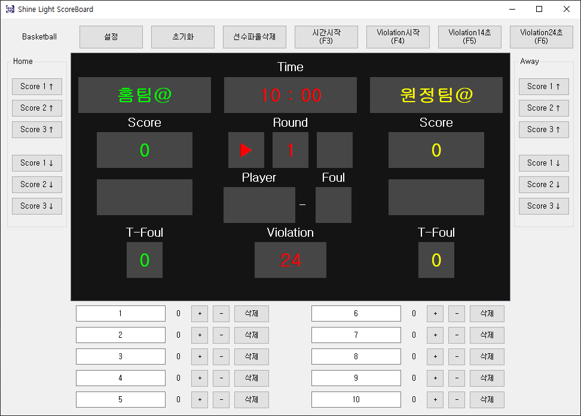
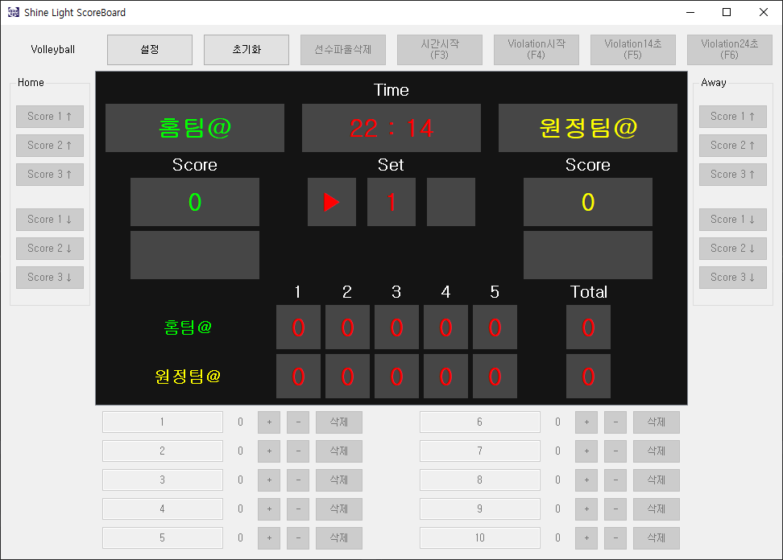
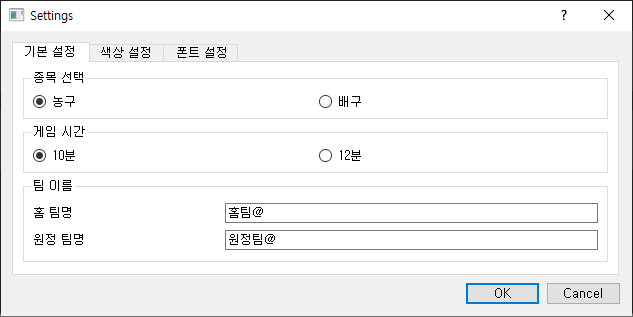
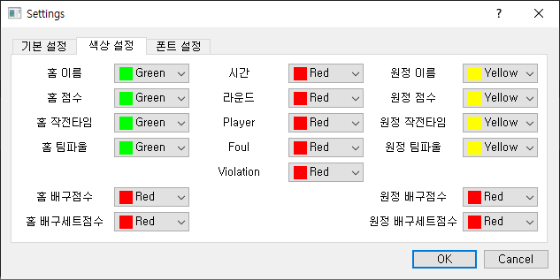
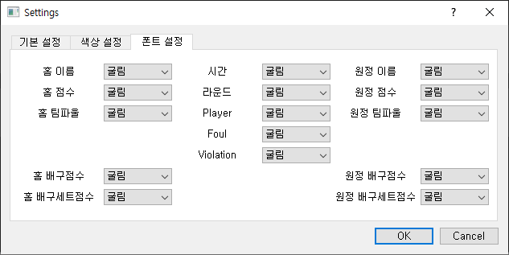

# ScoreBoard
농구와 배구의 점수 전광판 프로그램.

## Basketball
### 기능
+ 홈팀, 원정팀 점수 증가, 하락(+1,2,3 / -1,2,3)
+ 선수 파울 카운팅, 팀파울 자동화
+ violation 14, 24 자동화
+ round 설정 및 표시
### 결과

## Basketball
### 기능
+ 스코어보드 클릭을 통한 게임 점수 증가, 하락
+ 현재 시간 표시
+ 공격권 전환 기능
### 결과

## 설정
### 기능
+ 게임 종류 설정
+ 홈팀, 원정팀 이름 설정
+ 게임 시간
+ 전광판 각 항목 폰트, 색상 설정
### 결과

